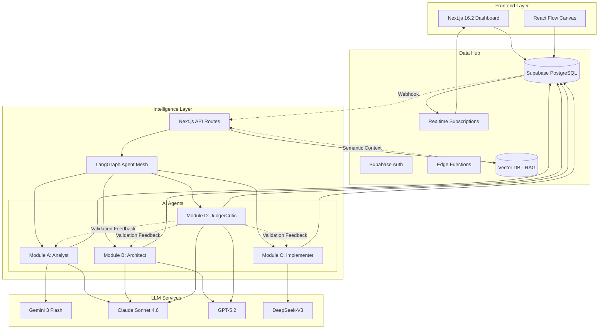
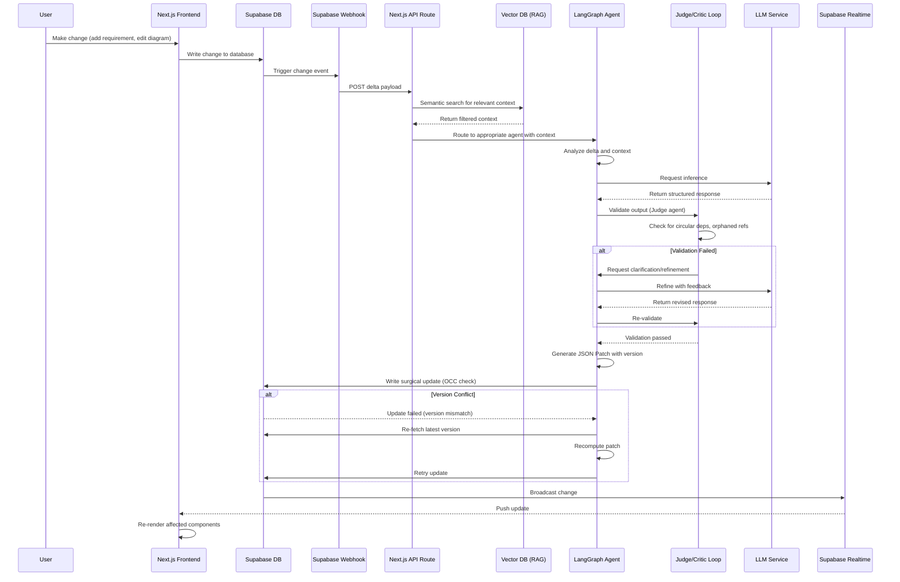

# Design Document: Synchro - AI-Native CASE Tool

## Overview

Synchro is an "Active Architect" Computer-Aided Software Engineering (CASE) tool that leverages an Agentic AI Mesh to automate transitions between Software Development Lifecycle (SDLC) phases. The system maintains bidirectional traceability between Requirements, Design Diagrams, and Code through intelligent agents that react to changes in real-time. The architecture follows a low-coupling philosophy where all modules communicate exclusively through a central Supabase database, enabling surgical updates via JSON Patches rather than full regenerations. This design supports incremental ingestion of requirements (including OCR from hand-drawn diagrams), visual modeling with UML/ERD support, code generation and reverse engineering, and continuous governance through automated validation agents.

## Tech Stack

- **Frontend & Backend**: Next.js 16.2+ (App Router, API Routes, Server Actions)
- **Styling**: Tailwind CSS, Shadcn/UI
- **Canvas**: React Flow for diagram visualization
- **Database**: Supabase Cloud (PostgreSQL, Auth, Realtime, Edge Functions)
- **Intelligence**: @langchain/langgraph (agent orchestration), Vercel AI SDK
- **Type Safety**: Zod validation, TypeScript strict mode
- **LLMs**: Claude Sonnet 4.6 (reasoning), Gemini 3 Flash (OCR), GPT-5.2 (validation), DeepSeek-V3 (code generation)
- **Vector DB**: Pinecone or Qdrant Cloud (semantic search)
- **Deployment**: Vercel (single Next.js app)

## Architecture

The system follows a hub-and-spoke architecture with Supabase as the central data hub. All modules are loosely coupled and communicate asynchronously through database changes and webhooks.

### Production-Grade Refinements (2026 Best Practices)

#### 1. Optimistic Concurrency Control (OCC)
To prevent race conditions when multiple agents modify the same artifact simultaneously:
- Each artifact has a `version` field (integer counter)
- Agents include the expected version when applying patches
- Database update uses: `UPDATE artifacts SET content = ..., version = version + 1 WHERE id = ... AND version = [expected_version]`
- If update fails (0 rows affected), agent re-syncs context and retries with exponential backoff
- Maximum 3 retry attempts before escalating to user

#### 2. Semantic Context Retrieval (RAG)
Instead of fetching full project context (which hits token limits for large projects):
- Use vector database (Pinecone/Qdrant) to store embeddings of all artifacts
- When webhook triggers, perform semantic search to fetch only relevant context
- Typical query: "Find all requirements, diagrams, and code related to [changed artifact]"
- Reduces token usage by 70-90% for large projects
- Falls back to full context for projects < 50 artifacts

#### 3. Critic/Refine Loop
Prevent compound errors by validating before database writes:
- Judge agent acts as "Critic" in the workflow (not just end-of-pipeline)
- After each agent generates output, Judge validates:
  - No circular dependencies in traceability graph
  - No orphaned requirements (0% coverage)
  - Valid UML/ERD relationships
  - Syntax validation for generated code
- If validation fails, agent receives feedback and refines (max 2 iterations)
- Prevents cascading errors across the agent mesh

#### 4. Iteration Limits
Prevent infinite agent loops:
- LangGraph state includes `iteration_count` field
- Maximum 5 iterations per agent invocation
- If limit reached, escalate to user with reasoning log
- Monitoring alerts trigger at 3+ iterations (indicates ambiguous requirements)

#### 5. Model Selection Strategy
Optimized for cost and performance in 2026:
- **Gemini 3 Flash**: OCR and multimodal extraction (Analyst) - 10x cheaper than GPT-4o, sub-second latency
- **Claude Sonnet 4.6**: Core reasoning and architecture decisions (Architect, Judge)
- **GPT-5.2**: Complex abstract reasoning for UML validation (fallback for Judge)
- **DeepSeek-V3**: Code generation (Implementer) - cost-effective for boilerplate



## System Workflow



## Components and Interfaces

### Component 1: Supabase Data Hub

**Purpose**: Central source of truth for all project data, authentication, and real-time synchronization

**Database Schema**:

```typescript
interface Project {
  id: string // UUID
  name: string
  description: string
  version: string
  created_at: timestamp
  updated_at: timestamp
  owner_id: string // FK to auth.users
}

interface Artifact {
  id: string // UUID
  project_id: string // FK to projects
  type: 'requirement' | 'diagram' | 'code' | 'adr'
  content: jsonb // Stable Key JSON Schema
  metadata: jsonb
  version: number // Optimistic Concurrency Control
  created_at: timestamp
  updated_at: timestamp
  created_by: string // FK to auth.users
}

interface ChangeLog {
  id: string // UUID
  artifact_id: string // FK to artifacts
  patch: jsonb // RFC 6902 JSON Patch
  applied_at: timestamp
  applied_by: string // 'user' | 'agent'
  agent_type: string // 'analyst' | 'architect' | 'implementer' | 'judge'
}

interface TraceabilityLink {
  id: string // UUID
  source_id: string // FK to artifacts
  target_id: string // FK to artifacts
  link_type: 'implements' | 'derives_from' | 'validates' | 'references'
  confidence: number // 0.0 to 1.0 (AI confidence score)
  created_at: timestamp
  created_by: string
}
```

**Responsibilities**:
- Store all project artifacts in normalized schema
- Maintain traceability links between artifacts
- Trigger webhooks on data changes
- Broadcast real-time updates to connected clients
- Handle authentication and authorization

### Component 2: Next.js Frontend

**Purpose**: User interface for viewing and editing requirements, diagrams, and code

**Interface**:

```typescript
interface DashboardProps {
  projectId: string
  userId: string
}

interface CanvasProps {
  artifactId: string
  diagramType: 'class' | 'sequence' | 'erd'
  nodes: DiagramNode[]
  edges: DiagramEdge[]
  onNodeChange: (nodeId: string, updates: Partial<DiagramNode>) => void
  onEdgeChange: (edgeId: string, updates: Partial<DiagramEdge>) => void
}

interface RequirementsTableProps {
  projectId: string
  requirements: Requirement[]
  onRequirementUpdate: (reqId: string, updates: Partial<Requirement>) => void
  onRequirementCreate: (requirement: NewRequirement) => void
}

interface DiagramNode {
  id: string
  type: 'class' | 'entity' | 'actor' | 'lifeline'
  position: { x: number; y: number }
  data: {
    label: string
    attributes?: string[]
    methods?: string[]
    stereotype?: string
  }
}

interface DiagramEdge {
  id: string
  source: string
  target: string
  type: 'association' | 'inheritance' | 'dependency' | 'composition' | 'aggregation'
  label?: string
}
```

**Responsibilities**:
- Render interactive React Flow canvas for diagram manipulation
- Display requirements in editable table format
- Subscribe to Supabase Realtime for live updates
- Send user changes to Supabase database
- Display AI agent suggestions and notifications

### Component 3: Next.js API Routes (Intelligence Worker)

**Purpose**: Orchestrate AI agents and handle webhook events from Supabase

**Interface**:

```typescript
interface WebhookPayload {
  event_type: 'INSERT' | 'UPDATE' | 'DELETE'
  table: string
  record: Record<string, any>
  old_record?: Record<string, any>
  timestamp: Date
}

interface AgentRouter {
  routeEvent(payload: WebhookPayload): AgentType
  dispatchToAgent(agentType: AgentType, payload: WebhookPayload): Promise<AgentResponse>
}

interface AgentResponse {
  agent_type: string
  patches: JSONPatch[]
  traceability_links: TraceabilityLink[]
  confidence: number
  reasoning: string
  expected_version: number  // For OCC validation
}
```

**Responsibilities**:
- Receive webhook events from Supabase via API routes
- Analyze deltas and determine which agent should handle the change
- Dispatch work to appropriate LangGraph agent
- Collect agent responses and write back to database
- Log all agent actions for audit trail

### Component 4: Module A - The Analyst (Ingestion Engine)

**Purpose**: Convert raw input (text, OCR images, PDFs) into structured Requirements Schema

**Interface**:

```typescript
class AnalystAgent {
  async ingestText(rawText: string, projectId: string): Promise<Requirement[]>
  async ingestImage(imageBytes: Buffer, projectId: string): Promise<Requirement[]>
  async ingestPdf(pdfBytes: Buffer, projectId: string): Promise<Requirement[]>
  async surgicalUpdate(existingReq: Requirement, delta: string): Promise<JSONPatch>
}

interface Requirement {
  id: string  // REQ_UNIQUE_ID
  title: string
  description: string
  type: 'functional' | 'non-functional'
  priority: 'low' | 'medium' | 'high'
  status: 'draft' | 'validated' | 'implemented'
  links: string[]  // References to other artifact IDs
}

interface JSONPatch {
  op: 'add' | 'remove' | 'replace' | 'move' | 'copy' | 'test'
  path: string  // JSON Pointer (RFC 6901)
  value?: any
  from?: string  // For 'move' and 'copy' operations
}
```

**Responsibilities**:
- Extract requirements from unstructured input using Gemini 3 Flash for OCR
- Parse hand-drawn diagrams and convert to structured class definitions
- Generate RFC 6902 JSON Patches for incremental updates
- Maintain stable requirement IDs to prevent index-shift errors
- Create initial traceability links based on requirement text analysis

### Component 5: Module B - The Architect (Modeling Canvas)

**Purpose**: Render visual designs and maintain bidirectional sync with requirements

**Interface**:

```typescript
class ArchitectAgent {
  async requirementsToDiagram(requirements: Requirement[]): Promise<Diagram>
  async suggestDiagramUpdates(reqDelta: JSONPatch, currentDiagram: Diagram): Promise<DiagramSuggestion[]>
  async diagramToRequirements(diagram: Diagram): Promise<Requirement[]>
  async validateDiagramConsistency(diagram: Diagram): Promise<ValidationIssue[]>
}

interface Diagram {
  id: string
  type: 'class' | 'sequence' | 'erd'
  nodes: DiagramNode[]
  edges: DiagramEdge[]
  layout: LayoutConfig
}

interface DiagramSuggestion {
  action: 'add_node' | 'remove_node' | 'add_edge' | 'remove_edge' | 'update_node'
  target_id: string
  data: Record<string, any>
  reasoning: string
  confidence: number
}

interface ValidationIssue {
  severity: 'error' | 'warning' | 'info'
  message: string
  affected_nodes: string[]
  suggested_fix?: string
}
```

**Responsibilities**:
- Generate UML Class, Sequence, and ERD diagrams from requirements
- Suggest diagram updates when requirements change
- Reverse engineer requirements from diagram modifications
- Validate diagram consistency (e.g., no orphaned nodes, valid relationships)
- Auto-layout nodes using force-directed or hierarchical algorithms

### Component 6: Module C - The Implementer (The Forge)

**Purpose**: Generate code from diagrams and reverse engineer diagrams from code

**Interface**:

```typescript
class ImplementerAgent {
  async diagramToCode(diagram: Diagram, template: CodeTemplate): Promise<GeneratedCode>
  async codeToDiagram(codeFiles: CodeFile[]): Promise<Diagram>
  async generateBoilerplate(projectType: string, config: Record<string, any>): Promise<CodeFile[]>
  async applyCodePatch(existingCode: string, patch: CodePatch): Promise<string>
}

interface CodeTemplate {
  language: string
  framework?: string
  templatePath: string
  variables: Record<string, any>
}

interface GeneratedCode {
  files: CodeFile[]
  dependencies: string[]
  setupInstructions: string
}

interface CodeFile {
  path: string
  content: string
  language: string
}

interface CodePatch {
  filePath: string
  hunks: PatchHunk[]
}

interface PatchHunk {
  startLine: number
  endLine: number
  oldContent: string
  newContent: string
}
```

**Responsibilities**:
- Generate TypeScript/Next.js boilerplate from class diagrams using Handlebars templates
- Parse TypeScript AST to reverse engineer class diagrams from existing code
- Apply surgical code updates using AST manipulation
- Maintain code-to-diagram traceability links
- Use DeepSeek-V3 for code generation tasks

### Component 7: Module D - The Judge (Governance Agent)

**Purpose**: Continuous quality control and consistency validation

**Interface**:

```typescript
class JudgeAgent {
  async validateProject(projectId: string): Promise<ValidationReport>
  async checkTraceabilityCoverage(projectId: string): Promise<CoverageReport>
  async detectCircularDependencies(projectId: string): Promise<CircularDependency[]>
  async generateAdr(decision: ArchitectureDecision): Promise<ADR>
}

interface ValidationReport {
  projectId: string
  timestamp: Date
  issues: ValidationIssue[]
  overallScore: number
  recommendations: string[]
}

interface CoverageReport {
  requirementsWithoutDiagrams: string[]
  requirementsWithoutCode: string[]
  orphanedCode: string[]
  coveragePercentage: number
}

interface CircularDependency {
  cycle: string[]  // Artifact IDs forming the cycle
  severity: 'error' | 'warning'
}

interface ADR {
  id: string
  title: string
  status: 'proposed' | 'accepted' | 'deprecated' | 'superseded'
  context: string
  decision: string
  consequences: string
  createdAt: Date
}
```

**Responsibilities**:
- Run background validation checks on project consistency
- Flag requirements with 0% code coverage
- Detect circular dependencies in traceability graph
- Generate Architecture Decision Records (ADRs) for significant changes
- Provide quality metrics and recommendations

## Data Models

### Stable Key JSON Schema (Requirements)

```json
{
  "project_metadata": {
    "id": "uuid",
    "version": "string",
    "last_updated": "timestamp"
  },
  "requirements": {
    "REQ_UNIQUE_ID": {
      "id": "string",
      "title": "string",
      "description": "text",
      "type": "functional | non-functional",
      "priority": "low | medium | high",
      "status": "draft | validated | implemented",
      "links": ["NODE_ID_1", "CODE_REF_1"],
      "metadata": {
        "created_at": "timestamp",
        "created_by": "string",
        "tags": ["string"]
      }
    }
  }
}
```

**Validation Rules**:
- `id` must be unique within project and follow pattern `REQ_[A-Z0-9]+`
- `title` must be non-empty and max 200 characters
- `description` must be non-empty
- `type` must be one of the enumerated values
- `links` must reference valid artifact IDs that exist in the database
- Stable keys prevent index-shift errors during AI updates

### Diagram Schema

```json
{
  "diagram_metadata": {
    "id": "uuid",
    "type": "class | sequence | erd",
    "version": "string"
  },
  "nodes": {
    "NODE_UNIQUE_ID": {
      "id": "string",
      "type": "class | entity | actor | lifeline",
      "position": {"x": "number", "y": "number"},
      "data": {
        "label": "string",
        "attributes": ["string"],
        "methods": ["string"],
        "stereotype": "string"
      },
      "links": ["REQ_ID_1"]
    }
  },
  "edges": {
    "EDGE_UNIQUE_ID": {
      "id": "string",
      "source": "NODE_ID",
      "target": "NODE_ID",
      "type": "association | inheritance | dependency | composition | aggregation",
      "label": "string",
      "multiplicity": {"source": "string", "target": "string"}
    }
  }
}
```

**Validation Rules**:
- Node IDs must be unique within diagram
- Edge source and target must reference existing node IDs
- Position coordinates must be non-negative numbers
- Edge types must follow UML/ERD conventions
- Inheritance edges cannot form cycles

### Code Artifact Schema

```json
{
  "code_metadata": {
    "id": "uuid",
    "language": "typescript | python | java",
    "framework": "string",
    "version": "string"
  },
  "files": {
    "FILE_PATH": {
      "path": "string",
      "content": "string",
      "ast_hash": "string",
      "links": ["DIAGRAM_NODE_ID", "REQ_ID"]
    }
  },
  "dependencies": ["string"]
}
```

**Validation Rules**:
- File paths must be unique within project
- Content must be valid syntax for specified language
- AST hash used for change detection
- Links must reference valid artifact IDs

## Correctness Properties

### Property 1: Traceability Completeness
For all requirements R in the system, there exists at least one traceability link to either a diagram node or code artifact, OR the requirement is explicitly marked as "draft" status.

```
∀r ∈ Requirements: 
  (r.status = "draft") ∨ 
  (∃link ∈ TraceabilityLinks: link.source_id = r.id ∧ link.target_id ∈ (DiagramNodes ∪ CodeArtifacts))
```

### Property 2: JSON Patch Idempotency
Applying the same JSON Patch twice to an artifact produces the same result as applying it once.

```
∀artifact ∈ Artifacts, ∀patch ∈ JSONPatches:
  apply(apply(artifact, patch), patch) = apply(artifact, patch)
```

### Property 3: Stable Key Preservation
AI-generated updates never modify the stable key structure of existing artifacts, only their values.

```
∀artifact ∈ Artifacts, ∀update ∈ AIUpdates:
  keys(artifact) = keys(apply(artifact, update))
```

### Property 4: Circular Dependency Detection
The traceability graph must be acyclic for "implements" and "derives_from" link types.

```
∀path ∈ TraceabilityPaths:
  (∀link ∈ path: link.type ∈ {"implements", "derives_from"}) ⟹
  (path.start ≠ path.end)
```

### Property 5: Real-time Consistency
All connected clients receive updates within a bounded time window after database changes.

```
∀change ∈ DatabaseChanges, ∀client ∈ ConnectedClients:
  timestamp(client.receives(change)) - timestamp(change.committed) ≤ MAX_LATENCY
```

### Property 6: Concurrency Safety (OCC)
No two agents can successfully apply conflicting patches to the same artifact simultaneously.

```
∀artifact ∈ Artifacts, ∀patch1, patch2 ∈ ConcurrentPatches:
  (patch1.artifact_id = patch2.artifact_id ∧ patch1.timestamp ≈ patch2.timestamp) ⟹
  (exactly_one_succeeds(patch1, patch2) ∧ other_retries_with_new_version)
```

### Property 7: Bounded Agent Iterations
No agent workflow executes more than the maximum iteration limit.

```
∀workflow ∈ AgentWorkflows:
  workflow.iteration_count ≤ MAX_ITERATIONS (5)
```

## Error Handling

### Error Scenario 1: OCR Extraction Failure

**Condition**: GPT-4o fails to extract structured data from uploaded image
**Response**: 
- Log error with image metadata and GPT-4o response
- Return partial extraction results if any
- Flag requirement as "draft" with low confidence score
**Recovery**: 
- Allow user to manually edit extracted data
- Retry with different OCR parameters
- Fallback to manual requirement entry

### Error Scenario 2: Webhook Delivery Failure

**Condition**: Supabase webhook fails to reach Next.js API route (network error, deployment issue)
**Response**:
- Supabase retries webhook with exponential backoff
- Log failed delivery attempts
- Alert monitoring system after 3 failed attempts
**Recovery**:
- Worker polls database for missed changes on startup
- Replay missed events from change log
- Resume normal operation once caught up

### Error Scenario 3: JSON Patch Conflict (Race Condition)

**Condition**: Two agents attempt to patch the same artifact simultaneously
**Response**:
- Use database-level Optimistic Concurrency Control with version numbers
- Second patch fails with conflict error (version mismatch)
- Return conflict details and latest version to agent
**Recovery**:
- Agent re-fetches latest artifact version from database
- Agent re-computes patch against new version
- Retries patch application with updated expected_version
- Uses exponential backoff: 100ms, 200ms, 400ms delays
- If conflicts persist after 3 attempts, escalate to user with reasoning log
- Log all retry attempts for monitoring and debugging

**Implementation**:
```typescript
async function applyPatchWithOcc(artifactId: string, patch: JSONPatch, expectedVersion: number) {
  for (let attempt = 0; attempt < 3; attempt++) {
    const result = await db.execute(
      `UPDATE artifacts SET content = jsonb_patch(content, $1), 
       version = version + 1, updated_at = NOW() 
       WHERE id = $2 AND version = $3 RETURNING version`,
      [patch, artifactId, expectedVersion]
    )
    if (result) {
      return result  // Success
    }
    
    // Version conflict - re-sync
    await new Promise(resolve => setTimeout(resolve, 100 * (2 ** attempt)))  // Exponential backoff
    const latest = await db.fetchOne("SELECT content, version FROM artifacts WHERE id = $1", [artifactId])
    patch = recomputePatch(latest.content, patch)
    expectedVersion = latest.version
  }
  
  throw new Error("Failed after 3 retries")
}
```

### Error Scenario 4: Invalid Diagram Generation

**Condition**: Architect agent generates diagram with invalid UML relationships
**Response**:
- Judge agent detects validation errors
- Block diagram from being saved to database
- Return validation errors to Architect agent
**Recovery**:
- Architect agent revises diagram based on validation feedback
- Re-runs generation with additional constraints
- If unable to resolve, save as "draft" and notify user

### Error Scenario 5: Code Generation Syntax Error

**Condition**: Implementer agent generates code with syntax errors
**Response**:
- Run syntax validation before saving to database
- Log syntax errors with code snippet
- Reject generated code
**Recovery**:
- Retry generation with explicit syntax constraints
- Use AST validation in generation loop
- Fallback to template-only generation without AI customization

## Testing Strategy

### Unit Testing Approach

Each module will have comprehensive unit tests covering:

**Analyst Module**:
- Test OCR extraction with sample hand-drawn diagrams
- Validate JSON Patch generation for various requirement updates
- Test stable key preservation across updates
- Verify requirement ID uniqueness

**Architect Module**:
- Test diagram generation from various requirement sets
- Validate bidirectional sync (requirements ↔ diagrams)
- Test auto-layout algorithms for different diagram types
- Verify UML/ERD relationship validity

**Implementer Module**:
- Test code generation from class diagrams
- Validate AST parsing and reverse engineering
- Test template rendering with various configurations
- Verify generated code syntax validity

**Judge Module**:
- Test circular dependency detection algorithms
- Validate traceability coverage calculations
- Test ADR generation logic
- Verify validation rule enforcement

**Coverage Goal**: 80% code coverage for all modules

### Property-Based Testing Approach

Use property-based testing to validate system invariants:

**Property Test Library**: fast-check (TypeScript)

**Key Properties to Test**:
1. JSON Patch application is associative: `apply(apply(x, p1), p2) = apply(x, merge(p1, p2))`
2. Diagram serialization round-trip: `deserialize(serialize(diagram)) = diagram`
3. Traceability graph remains acyclic after any update
4. Stable keys are preserved across all AI-generated patches
5. Real-time updates are eventually consistent across all clients

**Test Data Generation**:
- Generate random requirement sets with valid structure
- Generate random diagram topologies
- Generate random JSON Patches that preserve schema
- Generate random traceability link graphs

### Integration Testing Approach

Test end-to-end workflows across module boundaries:

**Test Scenario 1: Requirement to Code Flow**
1. Create new requirement via API
2. Verify Analyst agent processes it
3. Verify Architect agent generates diagram
4. Verify Implementer agent generates code
5. Verify Judge agent validates traceability
6. Assert all artifacts are linked correctly

**Test Scenario 2: Code Reverse Engineering Flow**
1. Upload existing TypeScript codebase
2. Verify Implementer agent extracts class structure
3. Verify Architect agent generates class diagram
4. Verify Analyst agent infers requirements
5. Assert traceability links are created

**Test Scenario 3: Real-time Sync Flow**
1. Connect multiple frontend clients
2. Make change in one client
3. Verify change propagates to database
4. Verify webhook triggers agent processing
5. Verify all clients receive real-time update
6. Assert eventual consistency

**Test Environment**: Supabase Cloud test project with Next.js development server

## Performance Considerations

### Database Query Optimization
- Index all foreign keys and frequently queried fields
- Use materialized views for traceability graph queries
- Implement connection pooling via Supabase client
- Use Supabase's built-in caching for frequently accessed artifacts

**Target Metrics**:
- Database query latency: < 50ms (p95)
- Webhook processing latency: < 500ms (p95)
- Real-time update propagation: < 200ms (p95)

### AI Inference Optimization
- Batch multiple small requests to LLMs when possible
- Cache LLM responses for identical inputs
- Use streaming responses for long-running generations
- Implement request queuing with priority levels

**Target Metrics**:
- OCR extraction: < 5 seconds per image
- Diagram generation: < 10 seconds per diagram
- Code generation: < 15 seconds per file
- Validation checks: < 2 seconds per artifact

### Frontend Performance
- Lazy load diagram nodes for large diagrams (> 100 nodes)
- Virtualize requirements table for large datasets
- Debounce user input to reduce database writes
- Use React.memo and useMemo for expensive renders

**Target Metrics**:
- Initial page load: < 2 seconds
- Canvas interaction latency: < 16ms (60 FPS)
- Real-time update render: < 100ms

### Scalability Targets
- Support projects with up to 10,000 requirements
- Support diagrams with up to 500 nodes
- Support 100 concurrent users per project
- Process 1,000 webhook events per minute

## Security Considerations

### Authentication & Authorization
- Use Supabase Auth with JWT tokens
- Implement Row-Level Security (RLS) policies for all tables
- Enforce project-level permissions (owner, editor, viewer)
- Validate all API requests with middleware

**RLS Policy Example**:
```sql
CREATE POLICY "Users can only access their projects"
ON projects FOR ALL
USING (owner_id = auth.uid() OR id IN (
  SELECT project_id FROM project_members WHERE user_id = auth.uid()
));
```

### Data Protection
- Encrypt sensitive data at rest (Supabase encryption)
- Use HTTPS for all API communication
- Sanitize all user inputs to prevent injection attacks
- Implement rate limiting on API endpoints

**Rate Limits**:
- OCR uploads: 10 per minute per user
- Requirement creation: 100 per minute per user
- Webhook processing: 1,000 per minute per project

### AI Safety
- Validate all AI-generated content before saving
- Implement content filtering for inappropriate outputs
- Log all AI interactions for audit trail
- Set token limits to prevent runaway costs

**Token Limits**:
- Max tokens per OCR request: 4,000
- Max tokens per diagram generation: 8,000
- Max tokens per code generation: 16,000

### Secrets Management
- Store API keys in environment variables
- Use Supabase Vault for sensitive configuration
- Rotate API keys quarterly
- Never log or expose API keys in responses

## Dependencies

### Frontend Dependencies
- Next.js 16.2+ (React framework)
- Tailwind CSS (styling)
- Shadcn/UI (component library)
- React Flow (canvas engine)
- @supabase/supabase-js (database client)
- @supabase/auth-helpers-nextjs (authentication)

### Backend Dependencies
- Next.js 16.2+ API Routes (backend endpoints)
- @langchain/langgraph (agent orchestration)
- Zod (type safety and validation)
- @supabase/supabase-js (latest Supabase client)
- @supabase/ssr (Server-Side Rendering helpers)
- handlebars (template engine)
- fast-json-patch (RFC 6902 implementation)
- @ai-sdk/anthropic (Claude integration)
- @ai-sdk/google (Gemini integration)
- @ai-sdk/openai (GPT integration)

### AI/ML Dependencies
- Anthropic Claude Sonnet 4.6 API (core reasoning and architecture tasks)
- Google Gemini 3 Flash API (OCR and multimodal extraction - cost-optimized)
- OpenAI GPT-5.2 API (complex abstract reasoning for UML validation)
- DeepSeek-V3 API (code generation)
- LangChain (LLM orchestration utilities)
- Vector Database (Pinecone/Qdrant) for semantic context retrieval (RAG)

### Infrastructure Dependencies
- Supabase Cloud (PostgreSQL, Auth, Realtime, Edge Functions)
- Vector Database (Pinecone or Qdrant Cloud for semantic search/RAG)
- Vercel (deployment platform for Next.js)
- GitHub Actions (CI/CD)

### Development Dependencies
- Vitest (TypeScript testing)
- fast-check (property-based testing)
- React Testing Library (component testing)
- Playwright (E2E testing)
- ESLint & Prettier (code formatting)
- TypeScript strict mode
